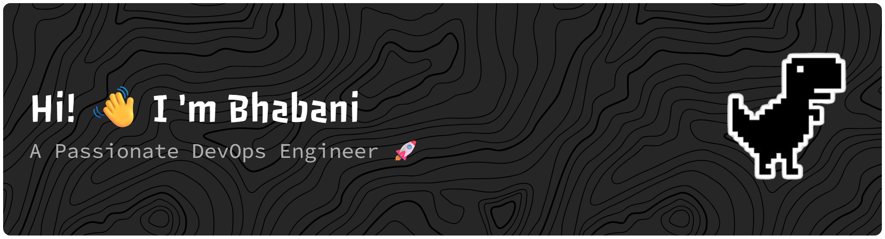

### About Me

- **🔭 I'm currently working on**
  - Designing and automating scalable CI/CD pipelines, improving cloud infrastructure reliability, and optimizing deployment workflows.

- **🌱 I'm currently learning**
  - Cloud architecture best practices, containerization at scale, GitOps workflows, and automation for enterprise-grade DevOps by integrating different DevOps tools.

- **👯 I'm looking to collaborate on**
  - Cloud-native DevOps projects and Open-source projects

- **🤝 I'm looking for help with**
  - Cloud cost optimization strategies, and enhancing infrastructure monitoring and observability.

- 💬 **Ask me about**
  - CI/CD, Infrastructure Automation, Cloud Deployment Strategies, Service Reliability, and DevOps best practices.

- **⚡ Fun fact**
  - I enjoy turning manual operational tasks into fully automated, efficient DevOps solutions.

<h3 align="left">Connect with me:</h3>

<h3 align="left">Languages and Tools:</h3>

                  

&nbsp;

