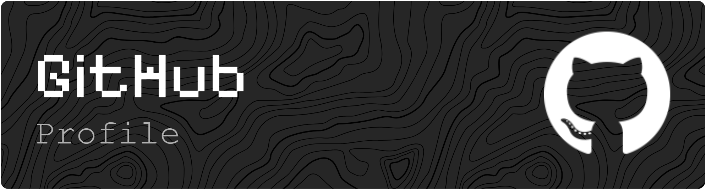

  

  
<!-- Typing SVG Animation -->

## 🚀 About Me

I'm a **DevOps Engineer**

- 🔭 **Working on** CI/CD automation and cloud reliability
- 🌱 **Learning** cloud architecture, GitOps, DevSecOps and AI
- 👯 **Open to** cloud-native and open-source collaborations
- 🤝 **Seeking** help to grow
- 💬 **Ask me about** CI/CD, IaC, and DevOps
- ⚡ **Fun fact** I automate manual tasks for fun!

 

## 🏆 GitHub Trophies

  

## 🛠️ Tech Arsenal

#### ☁️ Cloud & Infrastructure

#### 🐳 Containers & Orchestration

#### 🔄 CI/CD & Automation

#### 📊 Monitoring & Observability

#### 💻 Languages & Scripting

#### 🔧 Version Control & Tools

## 📊 GitHub Analytics

  
  

  

## 📈 Activity Graph

## 🐍 Contribution Snake

<picture>
  <source media="(prefers-color-scheme: dark)" srcset="https://github.com/BhabaniS1525/BhabaniS1525/blob/output/github-contribution-grid-snake.svg" />
  <source media="(prefers-color-scheme: light)" srcset="https://github.com/BhabaniS1525/BhabaniS1525/blob/output/github-contribution-grid-snake.svg" />
  
</picture>

## 💻 Most Used Languages

## 📫 Connect With Me

## 📊 Profile Stats

## 🎨 Contribution Metrics

## 🌟 GitHub Contributions (3D)

## 💭 Random Dev Quote

  
**⭐️ From [BhabaniS1525](https://github.com/BhabaniS1525)**

_"Automate everything, monitor religiously, deploy fearlessly"_ 🚀

